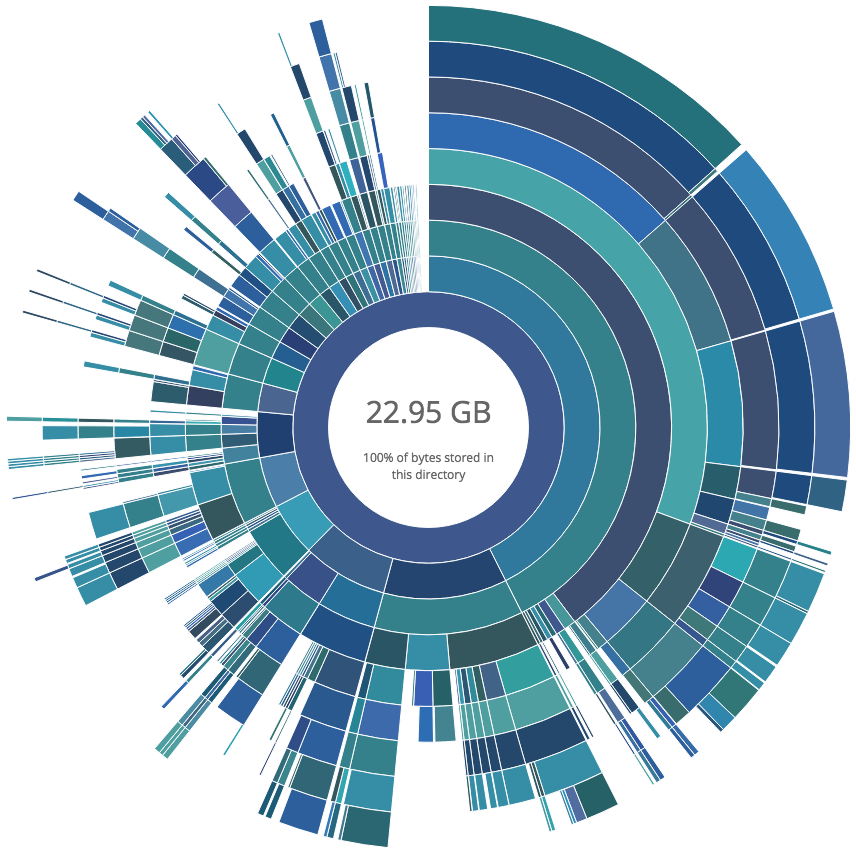

# dv - Disk Usage Visualization
<br><br>

<br><br><br>

About
----------

dv is a command line tool for visualizing disk data usage on systems that don't have access to a graphical environment. After scanning a directory, dv generates an interactive webpage that displays useful information about the disk's contents. This webpage is a sunburst partition layout, where each subdirectory is displayed as a portion of the scanned directory.

Hovering over a directory shows its size and percentage of the whole. dv is multiprocessed, and can be used to quickly visualize what is taking up space on a system.

Check out a [pre-generated plot](https://engineering.arm.gov/~dohnalek/dv_99c6f258f11a8f14a4d460f8e1c9fc4d/index.html?id=local).

Usage
-----------
dv has several options that can be explored with
```bash
dv --help
```
To get started as quickly as possible with a basic directory scan and plot, download this repository, cd to the `python` directory, and run:

```bash
python3 dv.py <directory-to-scan> --save-and-host <directory-to-store-plot>
```

If on windows, head over to the "release" section and get the latest windows build. Place it alongside dv.py and run:
```bash
dv.exe <directory-to-scan> --save-and-host <directory-to-store-plot>
```
